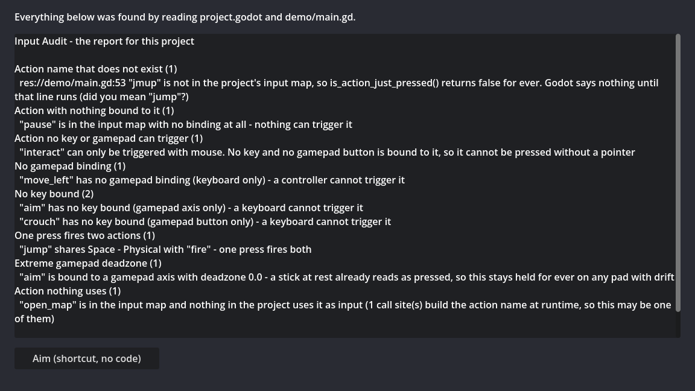

# Input Audit Lite

**Free version of [Input Audit](https://theidlehands.itch.io/input-audit) for Godot 4.4 – 4.7.**

Reads the input map and every place your code and scenes name an action, then reports action names that do not exist (with the nearest real name), actions nothing is bound to, actions a keyboard or a gamepad can never press, one press firing two actions, extreme deadzones, and actions nothing uses. Results go to the dock.

## Getting started

1. Copy `addons/input_audit/` into your project.
2. **Project → Project Settings → Plugins**, enable **Input Audit Lite**.
3. The dock appears bottom-right. Press **Check the project**.

The `demo/` folder is a small project with one of every fault planted in it.

## The full version adds

- **Markdown and JSON reports** (pinned schema for a build server)

→ **[Input Audit on itch.io](https://theidlehands.itch.io/input-audit)**

The full version installs into the same `addons/input_audit/` folder, so it replaces
this one in place.

## What it will not tell you

A clean report is a measurement against the checks above, not a guarantee.
The full version's page lists every limit in detail.

## Licence

The Lite version is MIT licensed (see `LICENSE`). The full version is sold
separately under its own licence.
